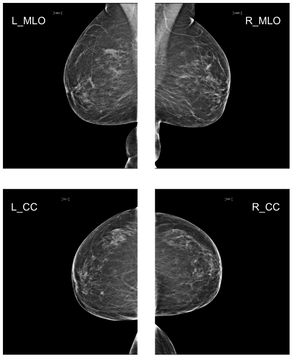
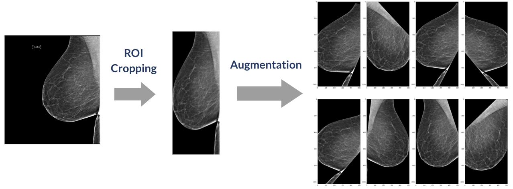

# Image Processing and Classification Model for Screening Mammography in Automated Detection of Breast Cancer

This project aimed to enhance breast cancer detection from mammography images by leveraging deep learning techniques, specifically Convolutional Neural Networks (CNN) and Vision Transformers (ViT). The goal was to create a robust image processing and classification model capable of identifying malignancies in mammograms, improving early cancer detection and potentially saving lives.

Methodology:

1. Data Collection and Preparation:

The dataset consists of 54,706 mammogram images collected from 11,913 patients, with each patient providing images of both breasts from at least two different views. In addition to the images, eleven variables were collected, including patient age, laterality (left or right breast), image orientation (CC or MLO), presence of breast implants, breast tissue density, biopsy results, whether the cancer was invasive, BIRADS diagnosis ratings, and whether the case was particularly difficult. The data was split into training and test groups in a 80:20 ratio for analysis.

2. Data Preprocessing
- **_ROI (Region of Interest) Cropping_** was employed to extract the breast area and exclude other non-breast regions from the images.
- **_Image Augmentation_** was applied to enhance dataset diversity and model robustness. This involved various transformations including
  - horizontal flip
  - rotation
  - auto contrast
  - resize crop
  - Gaussian blur
  - shift

3. Model Architecture:
- Baseline Models: Initial models included pre-trained CNN (ResNeXt) and Visual Transformer (DeiT3) architectures, which were fine-tuned for this specific medical imaging task.
- Weighted Loss: We used the weighted loss function to tackle the imbalanced data problem by giving more weight to the loss of cancer images. 
-Threshold: We used the sigmoid function to improve the model performance by discriminating between malignant and benign images in evaluation and testing.
-Auxiliary Prediction: The model was enhanced by incorporating auxiliary loss predictions, where additional output branches were added to predict 11 features related to the primary task of classifying mammogram images. This approach helped optimize the model by combining these auxiliary predictions with the main loss function, which improved overall performance by reducing the risk of gradient vanishing and preventing overfitting.

4. Experiment Settings and Evaluation Metrics:
- Used 5-fold cross-validation for model evaluation with the training dataset.
- Original high-resolution images in DICOM format were converted to PNG for easier processing.
- Images were resized to reduce training and testing overhead.

3. Training and Evaluation:
- A 5-fold cross-validation approach was used to train and evaluate the models.
- Various combinations of preprocessing techniques were tested to find the optimal model setup.

Results:

| Setting                 | Model         | Evaluation F1 | Test F1 | Recall | Precision | Accuracy |
|-------------------------|---------------|---------------|---------|--------|-----------|----------|
| Resized Original        | CNN(ResNeXt)  | 0.047         | 0.027   | 0.022  | 0.035     | 0.966    |
|                         | ViT(DeiT3)    | 0.037         | 0.0     | 0.0    | 0.0       | 0.979    |
| + ROI Crop              | CNN           | 0.057         | 0.108   | 0.359  | 0.063     | 0.874    |
| + Threshold             | CNN           | 0.122         | 0.076   | 0.351  | 0.043     | 0.820    |
| + Augmentation          | CNN           | 0.161         | 0.044   | 0.043  | 0.043     | 0.959    |
| + Auxiliary Prediction  | CNN(ResNeXt)  | 0.345         | 0.314   | 0.290  | 0.342     | 0.973    |
|                         | ViT(deit3)    | 0.130         | 0.063   | 0.126  | 0.042     | 0.921    |

The best-performing model was a CNN (ResNeXt) with all preprocessing steps (ROI cropping, augmentation, auxiliary predictions). This model achieved an F1 score of 0.345, significantly outperforming the baseline models. Despite the improvements, challenges remained due to the substantial data imbalance, highlighting areas for future research and development.

Conclusion:

This project demonstrated the potential of using deep learning to assist in breast cancer detection from mammography images. By systematically improving model architecture and addressing data imbalance, the project achieved a meaningful performance boost, laying the groundwork for further advancements in automated medical diagnostics.
